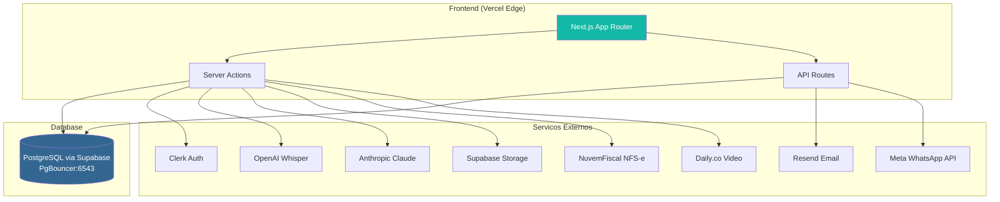
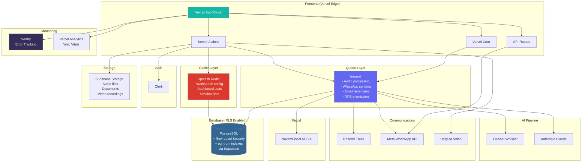
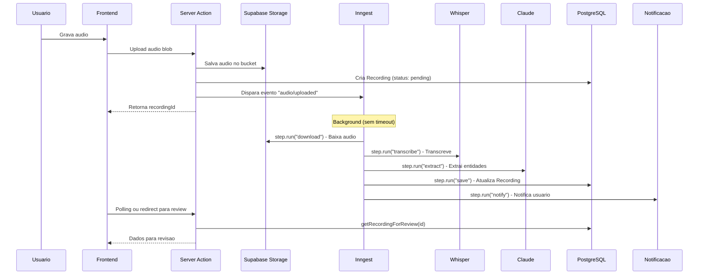
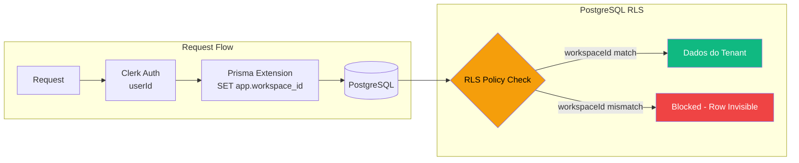

# Pesquisa de Arquitetura Backend & Infraestrutura — CRMs de Clinicas Medicas

> **Data:** 28/03/2026
> **Objetivo:** Analise exaustiva do stack tecnologico, infraestrutura e arquitetura de dados dos principais CRMs de clinicas medicas para informar decisoes arquiteturais do VoxClinic.

---

## Indice

1. [Tabela Comparativa de Tech Stack](#1-tabela-comparativa-de-tech-stack)
2. [Analise Detalhada por CRM](#2-analise-detalhada-por-crm)
3. [Arquitetura de Dados e Multi-Tenancy](#3-arquitetura-de-dados-e-multi-tenancy)
4. [APIs e Integracoes](#4-apis-e-integracoes)
5. [Performance e Escalabilidade](#5-performance-e-escalabilidade)
6. [Recomendacoes de Arquitetura para o VoxClinic](#6-recomendacoes-de-arquitetura-para-o-voxclinic)
7. [Diagramas de Arquitetura (Mermaid)](#7-diagramas-de-arquitetura-mermaid)
8. [Fontes](#8-fontes)

---

## 1. Tabela Comparativa de Tech Stack

| CRM | Backend | Framework | Frontend | Database | Cache | Queue/Jobs | Search | Cloud | CDN | Monitoramento | Pais |
|-----|---------|-----------|----------|----------|-------|------------|--------|-------|-----|---------------|------|
| **iClinic (Afya)** | Python, Node.js | Django, Express | React + Redux | PostgreSQL (inferido) | Redis (inferido) | N/D | Elasticsearch (inferido) | AWS | CloudFront | Datadog/Sentry (inferido) | BR |
| **GestaoDS** | N/D (provavel Node/Python) | N/D | N/D (provavel React/Vue) | N/D | N/D | N/D | N/D | N/D | N/D | N/D | BR |
| **Amplimed** | N/D | N/D | N/D | N/D | N/D | N/D | N/D | N/D | N/D | N/D | BR |
| **Feegow (Docplanner)** | PHP, Node.js | Laravel | Vue.js | MySQL | Redis (inferido) | N/D | N/D | AWS (inferido) | N/D | N/D | BR/PL |
| **Ninsaude Clinic** | N/D (provavel Python/Go) | N/D | Angular/React (inferido) | N/D (provavel PostgreSQL/Firestore) | N/D | N/D | N/D | Google Cloud (inferido) | N/D | N/D | BR |
| **Jane App** | Ruby, Python, Java, Go, C | Rails, Spring Boot | React, Backbone.js, Vue.js | PostgreSQL | Redis (inferido) | Sidekiq (inferido) | Fivetran (ETL) | **AWS** (migrou de Azure) | CloudFront | Datadog | CA |
| **Cliniko** | Ruby | Rails | React (migrando), Emotion | PostgreSQL (inferido) | Redis (inferido) | Sidekiq (inferido) | N/D | **AWS** (EC2) + DigitalOcean | CloudFront, Fastly | Honeybadger | AU |
| **SimplePractice** | Ruby | Rails | Ember.js, React, Redux | MySQL + PostgreSQL | **Redis** | Sidekiq (inferido) | **Elasticsearch** | **AWS** | N/D | **New Relic**, Bugsnag | US |
| **Kareo/Tebra** | Java | Spring Boot | React, Angular, MaterialUI | N/D (provavel PostgreSQL/SQL Server) | N/D | N/D | N/D | AWS (inferido) | N/D | N/D | US |
| **DrChrono (EverHealth)** | **Python** | **Django** | iOS nativo, Web | **MySQL** | N/D | Celery (inferido) | N/D | AWS (inferido) | N/D | N/D | US |

**Legenda:** N/D = Nao divulgado publicamente. "(inferido)" = baseado em vagas, contexto da industria ou stack tipico do framework.

---

## 2. Analise Detalhada por CRM

### 2.1 iClinic (Afya)

**Contexto:** Fundada em 2012 em Ribeirao Preto/SP. Adquirida pela Afya em 2020. Uma das maiores healthtechs brasileiras.

**Stack confirmado (via vagas Gupy/GitHub/LinkedIn):**
- **Backend:** Python/Django (principal) + Node.js (microservicos)
- **Frontend:** React + Redux
- **Infra:** AWS, com e sem Kubernetes
- **CI/CD:** Provavel GitHub Actions ou Jenkins (nao confirmado)

**Evidencias:**
- Vagas no portal `afya.gupy.io` para Backend Python/Django e Node.js Senior
- Repositorio `iclinic/iclinic-python-challenge` no GitHub confirma Python como linguagem principal
- Vagas no `react-brasil/vagas` (Issues #581, #1156) confirmam React no frontend
- Documentacao de API publica em `docs.iclinic.com.br` com autenticacao JWT Bearer

**Observacoes arquiteturais:**
- Migracao gradual de monolito Django para microservicos Node.js
- Uso de Kubernetes sugere orquestracao de containers com pelo menos parte dos servicos
- API REST publica documentada para integracoes

**Fontes:**
- [Afya Gupy - Vagas](https://afya.gupy.io/)
- [iClinic GitHub](https://github.com/iclinic)
- [iClinic API Docs](https://docs.iclinic.com.br/)
- [react-brasil/vagas #581](https://github.com/react-brasil/vagas/issues/581)
- [backend-br/vagas #3518](https://github.com/backend-br/vagas/issues/3518)

---

### 2.2 GestaoDS

**Contexto:** Startup de Santa Maria/RS. Software medico com prontuario eletronico e IA.

**Stack:** Pouco divulgado publicamente. A cultura da empresa e marcada pela metafora do "navio viking".

**Evidencias limitadas:**
- Portal de vagas em `vempragestaods.gupy.io`
- Avaliacao no Glassdoor com 1 review (empresa pequena)
- Nenhuma vaga tecnica detalhada encontrada publicamente

**Inferencias:**
- Empresa relativamente pequena (~20-50 funcionarios estimados)
- Provavel stack moderno (Node.js ou Python) baseado no perfil de startup brasileira recente
- Foco em IA no prontuario sugere integracao com APIs de LLM

**Fontes:**
- [GestaoDS Gupy](https://vempragestaods.gupy.io/)
- [GestaoDS Glassdoor](https://www.glassdoor.com/Reviews/Gest%C3%A3oDS-Reviews-E3303850.htm)
- [GestaoDS Site](https://www.gestaods.com.br/)

---

### 2.3 Amplimed (Grupo RaiaDrogasil)

**Contexto:** Fundada ha ~9 anos em Chapeco/SC. Adquirida pela RaiaDrogasil. Atende 20mil+ profissionais, 3mil+ clinicas, 700mil+ consultas mensais, 9M+ pacientes.

**Stack:** Nao divulgado publicamente. GitHub (`github.com/amplimed`) tem perfil organizacional mas sem repositorios publicos vissiveis.

**Evidencias:**
- Blog menciona FHIR (Fast Healthcare Interoperability Resources) como padrao de integracao
- Portal de vagas em `amplimed.selecty.com.br`
- Escala significativa (700k consultas/mes) sugere arquitetura robusta

**Inferencias baseadas na escala:**
- Provavel microservicos devido ao volume
- Integracao com farmacia (RaiaDrogasil) sugere APIs FHIR/REST sofisticadas
- Necessidade de alta disponibilidade para volume de consultas

**Fontes:**
- [Amplimed GitHub](https://github.com/amplimed)
- [Amplimed Site](https://www.amplimed.com.br/)
- [Amplimed Crunchbase](https://www.crunchbase.com/organization/amplimed)
- [Amplimed Capterra](https://www.capterra.com/p/204304/Amplimed/)

---

### 2.4 Feegow Clinic (Grupo Docplanner)

**Contexto:** Fundada no Rio de Janeiro. Adquirida pelo Docplanner Group (Doctoralia) em 2022. 33mil+ profissionais de saude. Faz parte de uma empresa global com presenca em 13 paises.

**Stack confirmado (via vagas SmartRecruiters/BuiltIn):**
- **Backend:** PHP (Laravel) + Node.js
- **Frontend:** Vue.js
- **Database:** MySQL
- **DevOps:** Docker, GIT
- **Documentacao API:** Swagger

**Evidencias:**
- Vagas em `jobs.smartrecruiters.com/Docplanner` para "Full-Stack Developer (PHP and Node.JS)"
- Requisitos: JavaScript, PHP, MySQL, GIT, Docker, Swagger
- API publica para integracoes com sistemas de saude
- Pacote NPM para consumo da API Feegow

**Observacoes arquiteturais:**
- Heranca de stack PHP/Laravel do Docplanner Group (fundado em 2012 na Polonia)
- Adicao de Node.js sugere modernizacao progressiva
- Docker para containerizacao
- Integracoes extensas via API REST

**Fontes:**
- [Docplanner/Feegow Vaga Full-Stack PHP](https://jobs.smartrecruiters.com/Docplanner/744000019573275)
- [Docplanner/Feegow Vaga Full-Stack PHP+Node](https://jobs.smartrecruiters.com/Docplanner/744000031719981)
- [Feegow Integracoes](https://help.docplanner.com/s/topic/0TOP40000001Zd0OAE/clinic-integrations-feegow)
- [Feegow GitHub](https://github.com/feegow)

---

### 2.5 Ninsaude Clinic

**Contexto:** Fundada em 2013, sede em Criciuma/SC. Especialista em TI para saude. Usada em 200+ clinicas. Lancou IA 224Scan para laudos de imagem em 60 segundos.

**Stack:** Pouco divulgado. Nenhuma vaga tecnica detalhada encontrada.

**API:**
- API RESTful publica (plataforma "Ninsaude Toro")
- Autenticacao OAUTH2
- Milhares de rotas disponiveis
- Webhooks (triggers) para notificacao de aplicacoes externas
- Documentacao extensa em `ninsaude.com/pt-br/desenvolvedores/`

**Inferencias:**
- API REST madura com OAUTH2 sugere backend robusto
- Presenca de webhooks indica arquitetura orientada a eventos
- Foco em IA e laudos sugere uso de servicos de ML/AI
- Nome "Ninsaude Toro" para plataforma dev sugere produto separado

**Fontes:**
- [Ninsaude Developers](https://www.ninsaude.com/pt-br/desenvolvedores/)
- [Ninsaude Sobre](https://www.ninsaude.com/pt-br/sobre/)
- [Ninsaude Distrito Healthtech](https://distrito.me/blog/ninsaude-healthtech-investimento/)
- [Ninsaude ACATE - IA 224Scan](https://www.acate.com.br/noticias/ninsaude-lanca-ia-que-faz-laudo-de-exame-em-60-segundos/)

---

### 2.6 Jane App

**Contexto:** Fundada em 2012 em North Vancouver, Canada. 501-1000 funcionarios. Atingiu $100M ARR. Usada por 100k+ profissionais globalmente. Migrou de Azure para AWS.

**Stack confirmado (via Himalayas/StackShare/Vagas):**
- **Backend:** Ruby on Rails (principal), Python, Java (Spring Boot), Go, C
- **Frontend:** React (principal), Backbone.js (legado), Vue.js, React Native (mobile)
- **Database:** PostgreSQL
- **Infra:** AWS (EC2, migrou de Azure), NGINX, Passenger
- **ETL/Analytics:** Fivetran, Snowflake, Datadog
- **CDN:** Cloudflare CDN + Cloudflare Bot Management
- **CI/CD:** CircleCI
- **Design:** Figma
- **Suporte:** Help Scout

**Observacoes arquiteturais:**
- **Migracao Azure -> AWS** motivada por compliance regional (PIPEDA Canada, HIPAA EUA, PCI, SOC 2)
- Uso de Claude (Anthropic) via AWS Bedrock para features de IA
- Stack poliglota (Ruby, Python, Java, Go) sugere microservicos maduros
- Snowflake para data warehouse indica investimento em analytics
- React Native para mobile cross-platform

**Fontes:**
- [Jane App Tech Stack - Himalayas](https://himalayas.app/companies/jane-app/tech-stack)
- [Jane App StackShare](https://stackshare.io/jane-clinic-management-software/janeapp-com)
- [Jane App AWS Migration](https://www.startupecosystem.ca/news/jane-app-scales-healthcare-solutions-with-aws-support/)
- [Jane App Vaga Full Stack - Workable](https://apply.workable.com/cliniko/j/B8F753BB53)
- [Jane App Vaga Staff Engineer - Communitech](https://www1.communitech.ca/companies/jane-app-2/jobs/41739708-staff-full-stack-software-developer-onboarding)

---

### 2.7 Cliniko

**Contexto:** Fundada em Melbourne, Australia. ~63 funcionarios, 100% remoto. Semana de 30 horas. Usada por 100k+ pessoas diariamente. Sem managers, quase sem reunioes.

**Stack confirmado (via Himalayas/Vagas/RubyOnRemote):**
- **Backend:** Ruby on Rails
- **Frontend:** React (transicao em andamento), Emotion (CSS-in-JS), Modernizr
- **Database:** PostgreSQL (inferido — "relational databases" nas vagas)
- **Infra:** AWS (EC2, S3, Route 53, CloudFront) + DigitalOcean
- **CDN:** CloudFront + Fastly (dual CDN)
- **Monitoramento:** Honeybadger, StatusPage.io
- **Email:** Mailgun
- **CI/CD:** N/D
- **Static Site:** Gatsby + Netlify (site marketing)

**Observacoes arquiteturais:**
- Stack deliberadamente simples — equipe pequena (63 pessoas) com alta produtividade
- Rails monolito com frontend em transicao para React
- Dual hosting (AWS + DigitalOcean) sugere separacao entre app e assets/CDN
- Dual CDN (CloudFront + Fastly) para alta disponibilidade
- Vagas nao exigem experiencia em Rails especificamente, indicando abertura a devs de outros backgrounds

**Fontes:**
- [Cliniko Tech Stack - Himalayas](https://himalayas.app/companies/cliniko/tech-stack)
- [Cliniko Vaga Full Stack - WeWorkRemotely](https://weworkremotely.com/remote-jobs/cliniko-full-stack-developer-for-a-unique-company)
- [Cliniko Vaga - RubyOnRemote](https://rubyonremote.com/jobs/36956-software-developer-at-cliniko)
- [Cliniko Vaga - Workable](https://apply.workable.com/cliniko/j/B8F753BB53)

---

### 2.8 SimplePractice

**Contexto:** Fundada em Santa Monica, CA. 200k+ profissionais. HIPAA compliant, HITRUST CSF Certified, PCI Compliant. Foco em saude mental/comportamental.

**Stack confirmado (via StackShare — 23 ferramentas listadas):**
- **Backend:** Ruby, Rails
- **Frontend:** Ember.js (principal), React, Redux
- **Mobile:** Swift (iOS), Android SDK
- **Database:** MySQL + PostgreSQL (dual DB)
- **Cache:** Redis
- **Search:** Elasticsearch
- **Web Server:** NGINX + Passenger
- **Email:** Twilio SendGrid
- **Telefonia:** Plivo
- **Monitoramento:** New Relic, Bugsnag
- **CI/CD:** Semaphore
- **Infra Config:** Chef
- **PM:** Pivotal Tracker
- **Suporte:** Zendesk
- **Analytics:** Mixpanel

**Observacoes arquiteturais:**
- **Dual database (MySQL + PostgreSQL)** — possivelmente MySQL como banco principal legado e PostgreSQL para novos servicos ou analytics
- **Redis** para caching e possivelmente Sidekiq (background jobs)
- **Elasticsearch** para busca full-text (pacientes, prontuarios)
- **Ember.js** como framework frontend principal (escolha menos comum, pode dificultar recrutamento)
- **Chef** para infra-as-code sugere bare metal ou VMs em cloud (nao serverless)
- Stack HIPAA-compliant com criptografia bank-level e verificacao em duas etapas

**Fontes:**
- [SimplePractice StackShare](https://stackshare.io/simplepractice/simplepractice)
- [SimplePractice Security](https://www.simplepractice.com/features/security/)
- [SimplePractice DevOps Vaga - RemoteRocketship](https://www.remoterocketship.com/company/simplepractice/jobs/devops-engineer-mexico/)
- [SimplePractice Tech Stack - StackWho](https://stackwho.com/company/simplepracticecom/)

---

### 2.9 Kareo/Tebra

**Contexto:** Fusao Kareo + PatientPop em 2021 formou Tebra. Irvine, CA. 140k+ providers, 120M+ pacientes nos EUA. Adquirida pela EverHealth.

**Stack confirmado (via vagas Greenhouse/LinkedIn):**
- **Backend:** Java, Spring Boot
- **Frontend:** React (principal), Angular (legado), MaterialUI
- **Arquitetura:** Micro front-ends
- **Monorepo:** Sim (com Yarn/NPM workspaces)
- **API:** SOAP APIs (legado) para integracoes externas
- **Tooling:** TypeScript, Jest, Cypress
- **Infraestrutura:** Private + public cloud data centers, auditorias de seguranca terceirizadas

**Observacoes arquiteturais:**
- **Micro front-end architecture** — separacao de frontends por dominio (EHR, billing, marketing, patient engagement)
- **SOAP APIs** para integracao (legado, nao REST) — indica codebase madura/antiga
- **Java + Spring Boot** no backend confirma escolha enterprise
- Fusao de dois produtos (Kareo + PatientPop) provavelmente resultou em stack heterogeneo
- Transicao ativa de Angular para React com MaterialUI

**Fontes:**
- [Tebra Vagas - Greenhouse](https://job-boards.greenhouse.io/tebra/jobs/4515209005)
- [Tebra Staff Engineer Vaga](https://job-boards.greenhouse.io/tebra/jobs/4670199005)
- [Tebra Frontend Senior - BuiltIn LA](https://www.builtinla.com/job/senior-software-engineer/157141)
- [Tebra API Docs](https://helpme.tebra.com/Tebra_PM/12_API_and_Integration)
- [Tebra Wikipedia](https://en.wikipedia.org/wiki/Tebra)

---

### 2.10 DrChrono (EverHealth)

**Contexto:** Fundada em Mountain View, CA. Plataforma EHR para iOS e Web. Pioneira em EHR mobile (iPad). Parte do grupo EverHealth.

**Stack confirmado (via Wikipedia/Vagas/GitHub):**
- **Backend:** Python, Django
- **OS:** Linux
- **Database:** MySQL
- **Frontend:** iOS nativo (Swift/ObjC), Web
- **API:** REST API com documentacao (OpenAPI/Swagger)
- **Linguagens API:** Suporte oficial para Python e C# nos scripts de integracao

**Observacoes arquiteturais:**
- **Python/Django monolito** — stack classico de startup de Silicon Valley
- **MySQL** como banco principal (nao PostgreSQL)
- **iOS-first** — diferencial competitivo desde o lancamento
- API REST publica e bem documentada para integracao de terceiros
- Open-source contributions via GitHub (`github.com/drchrono`)
- Stack HIPAA-compliant com BAA padrao

**Fontes:**
- [DrChrono Wikipedia](https://en.wikipedia.org/wiki/DrChrono)
- [DrChrono Vaga Python/Django - Lever](https://jobs.lever.co/drchrono/46df156d-71cb-48d0-8172-013270f3a418)
- [DrChrono API Docs](https://app.drchrono.com/api-docs/)
- [DrChrono GitHub](https://github.com/drchrono)
- [DrChrono API Scripts](https://support.drchrono.com/home/getting-started-with-drchrono-api-code-scripts)
- [DrChrono HN Hiring](https://news.ycombinator.com/item?id=15458433)

---

## 3. Arquitetura de Dados e Multi-Tenancy

### 3.1 Abordagens de Multi-Tenancy Observadas

| Abordagem | CRMs que provavelmente usam | Complexidade | Isolamento | Custo |
|-----------|---------------------------|--------------|------------|-------|
| **Shared DB + Shared Schema** (tenant_id por tabela) | iClinic, Feegow, Ninsaude, DrChrono, SimplePractice, VoxClinic (atual) | Baixa | Medio (app-level) | Baixo |
| **Shared DB + Schema-per-tenant** | GestaoDS (possivel) | Media | Alto | Medio |
| **DB-per-tenant** | Amplimed (possivel, pela escala), Jane App (possivel para compliance regional) | Alta | Muito Alto | Alto |

### 3.2 VoxClinic Atual: Shared DB + Shared Schema

O VoxClinic atualmente usa a abordagem mais simples e econonica:
- Todas as tabelas possuem `workspaceId` como chave de isolamento
- Queries filtradas por `workspaceId` no nivel da aplicacao
- Constraint `@@unique([workspaceId, document])` para CPF unico por workspace
- Indexes compostos `@@index([workspaceId, name])` e `@@index([workspaceId, date])`

**Riscos atuais:**
- Isolamento depende 100% do codigo da aplicacao (nenhum query pode esquecer o `WHERE workspaceId = ?`)
- Sem Row-Level Security (RLS) no PostgreSQL
- Um bug em qualquer server action pode expor dados entre tenants

### 3.3 Tratamento de Dados Sensiveis de Saude

| Aspecto | Padrao da Industria | VoxClinic Atual |
|---------|-------------------|-----------------|
| Criptografia at-rest | AES-256 no disco | Supabase default (AES-256 via cloud provider) |
| Criptografia in-transit | TLS 1.2+ | Sim (Supabase enforced) |
| Criptografia de campos sensiveis | AES-256 em colunas especificas (CPF, prontuario) | Nao implementado |
| Backups | Diarios com retencao de 30+ dias | Supabase automated (7-30 dias dependendo do plano) |
| Imutabilidade de prontuario | Versionamento ou append-only | Nao implementado |
| Audit trail | Log de todas as operacoes CRUD | Implementado (AuditLog model) |
| Anonimizacao | Para ambientes de teste/dev | Nao implementado |
| LGPD consent | Consentimento antes de gravacao | Implementado (ConsentRecord model) |

### 3.4 Compliance por Regiao

| Regulacao | CRMs Compliance | VoxClinic |
|-----------|----------------|-----------|
| **LGPD (Brasil)** | iClinic, Feegow, Amplimed, GestaoDS, Ninsaude | Parcial (consent, audit log, dados em sa-east-1) |
| **HIPAA (EUA)** | SimplePractice, DrChrono, Tebra, Jane App | N/A |
| **PIPEDA (Canada)** | Jane App | N/A |
| **CFM Res. 1821/2007** | Todos BR (prontuario 20 anos) | Parcial (soft delete, sem versionamento) |

---

## 4. APIs e Integracoes

### 4.1 Comparativo de APIs Publicas

| CRM | API Publica | Tipo | Auth | Documentacao | Webhooks | Marketplace |
|-----|------------|------|------|-------------|----------|-------------|
| **iClinic** | Sim | REST | JWT Bearer | docs.iclinic.com.br | N/D | Nao |
| **GestaoDS** | N/D | N/D | N/D | N/D | N/D | Nao |
| **Amplimed** | Sim (FHIR-ready) | REST | N/D | N/D | N/D | Nao |
| **Feegow** | Sim | REST | N/D | Sim | N/D | Nao |
| **Ninsaude** | **Sim (robusto)** | **REST** | **OAUTH2** | **Extensa (milhares de rotas)** | **Sim (triggers)** | Nao |
| **Jane App** | Sim | REST | N/D | N/D | N/D | Nao |
| **Cliniko** | Sim | REST | N/D | Sim | N/D | Sim (integracoes) |
| **SimplePractice** | Limitado | REST | N/D | N/D | N/D | Nao |
| **Tebra** | Sim (legado) | **SOAP** | N/D | Sim | N/D | Nao |
| **DrChrono** | **Sim (robusto)** | **REST** | **OAuth2** | **Extensa (Swagger)** | **Sim** | **Sim** |

### 4.2 Destaque: Ninsaude e DrChrono como referencia

**Ninsaude Toro** se destaca no mercado BR:
- API RESTful com OAUTH2
- Milhares de rotas documentadas
- Sistema de webhooks/triggers para eventos (criacao, edicao, exclusao)
- Objeto JSON correspondente enviado nas notificacoes

**DrChrono** se destaca no mercado US:
- API REST completa com Swagger/OpenAPI
- OAuth2 para autenticacao
- Exemplos em Python e C# no GitHub
- Marketplace de integracoes com terceiros

### 4.3 Integracoes Comuns no Setor

| Categoria | Exemplos | CRMs que oferecem |
|-----------|----------|-------------------|
| Laboratorios | Resultados de exames via FHIR/HL7 | Amplimed, Tebra, DrChrono |
| Farmacias | Prescricao eletronica | Amplimed (RaiaDrogasil), Ninsaude |
| Operadoras TISS | Faturamento TISS/XML | Amplimed, Feegow, iClinic, Ninsaude |
| Telemedicina | Video call integrado | Amplimed, Feegow, Jane App, SimplePractice, Cliniko |
| WhatsApp | Lembretes e confirmacao | iClinic, Feegow, VoxClinic |
| NFS-e | Nota fiscal eletronica | iClinic, VoxClinic |
| Pagamentos | Gateway de pagamento | Jane App (Stripe), SimplePractice |

---

## 5. Performance e Escalabilidade

### 5.1 Escala Declarada

| CRM | Profissionais | Clinicas | Consultas/mes | Pacientes |
|-----|--------------|----------|---------------|-----------|
| **Amplimed** | 20.000+ | 3.000+ | 700.000+ | 9.000.000+ |
| **Feegow** | 33.000+ | N/D | N/D | N/D |
| **Ninsaude** | N/D | 200+ | N/D | N/D |
| **iClinic** | N/D | N/D | N/D | N/D |
| **Jane App** | 100.000+ | N/D | N/D | N/D |
| **Cliniko** | 100.000+ (usuarios diarios) | N/D | N/D | N/D |
| **SimplePractice** | 200.000+ | N/D | N/D | N/D |
| **Tebra** | 140.000+ | N/D | N/D | 120.000.000+ |

### 5.2 Estrategias de Performance Observadas

| Estrategia | CRMs que usam | Relevancia para VoxClinic |
|-----------|---------------|---------------------------|
| **Redis caching** | SimplePractice, Jane App (inferido) | **Alta** — cache de dados de workspace, procedures, configuracoes |
| **Elasticsearch** | SimplePractice | **Media** — busca full-text de pacientes (atualmente com LIKE/ILIKE) |
| **CDN (CloudFront/Fastly)** | Cliniko, Jane App | **Media** — Vercel ja fornece CDN edge |
| **Background jobs (Sidekiq)** | SimplePractice, Cliniko, Jane App | **Alta** — processamento de audio, envio de WhatsApp, lembretes |
| **Data warehouse (Snowflake)** | Jane App | **Baixa** (prematura para estagio atual) |
| **Micro front-ends** | Tebra | **Baixa** (complexidade excessiva para equipe pequena) |

### 5.3 SLA/Uptime

Nenhum dos CRMs pesquisados divulga SLA publicamente em suas paginas de marketing. SimplePractice menciona "bank-level encryption" e "multiple layers of security" mas nao especifica uptime.

Cliniko usa StatusPage.io para monitoramento de status publico, o que e uma boa pratica.

---

## 6. Recomendacoes de Arquitetura para o VoxClinic

### 6.1 Prioridade 1: Seguranca Multi-Tenant (Row-Level Security)

**Problema atual:** Todo isolamento de tenant depende do codigo da aplicacao. Um `WHERE` esquecido expoe dados entre workspaces.

**Recomendacao:** Implementar PostgreSQL Row-Level Security (RLS) como camada adicional de seguranca.

```sql
-- Habilitar RLS nas tabelas principais
ALTER TABLE "Patient" ENABLE ROW LEVEL SECURITY;
ALTER TABLE "Appointment" ENABLE ROW LEVEL SECURITY;
ALTER TABLE "Recording" ENABLE ROW LEVEL SECURITY;

-- Policy que filtra por workspaceId baseado no contexto da sessao
CREATE POLICY tenant_isolation ON "Patient"
  USING ("workspaceId" = current_setting('app.workspace_id', true));
```

**Implementacao com Prisma:**
- Usar Prisma Client Extensions para setar `app.workspace_id` no inicio de cada request
- Referencia: [Prisma RLS com Extensions](https://medium.com/@francolabuschagne90/securing-multi-tenant-applications-using-row-level-security-in-postgresql-with-prisma-orm-4237f4d4bd35)
- Issue oficial: [prisma/prisma#12735](https://github.com/prisma/prisma/issues/12735)

**Complexidade:** Media. Requer:
1. Migrations SQL para habilitar RLS e criar policies
2. Prisma Extension para setar contexto por request
3. Testes automatizados de isolamento

---

### 6.2 Prioridade 2: Sistema de Filas para Background Jobs

**Problema atual:** Processamento de audio (Whisper + Claude), envio de WhatsApp, lembretes por email e crons rodam inline ou em API routes com timeout de 60s (Vercel).

**Recomendacao:** Adotar **Inngest** ou **Trigger.dev** para background jobs.

| Solucao | Preco | Vantagem | Desvantagem |
|---------|-------|----------|-------------|
| **Inngest** | Free tier generoso, $25/mo pro | Integrado ao Vercel Marketplace, step functions, retry automatico, event-driven | Vendor lock-in |
| **Trigger.dev** | Free tier, $30/mo pro | Sem timeout de Vercel (roda em infra propria), logs extensos, debugging superior | Infra separada |
| **QStash (Upstash)** | Pay-per-message | Simples, HTTP-based, bom para tarefas simples | Sem orquestracao complexa |
| **Vercel Cron** | Incluso no plano Pro | Zero config, ja em uso | Max 60s runtime, sem retry, sem queue |

**Recomendacao especifica: Inngest**
- Melhor integracao com Vercel (marketplace oficial)
- Step functions para pipelines complexos (audio upload -> transcricao -> extracao IA -> notificacao)
- Retry automatico com backoff exponencial
- Event-driven (pode reagir a criacao de appointment, upload de audio, etc.)
- Dashboard para observabilidade

**Exemplo de uso:**
```typescript
// src/inngest/functions/process-audio.ts
export const processAudio = inngest.createFunction(
  { id: "process-audio", retries: 3 },
  { event: "audio/uploaded" },
  async ({ event, step }) => {
    const transcript = await step.run("transcribe", () =>
      transcribeAudio(event.data.audioBuffer, event.data.filename)
    );
    const extraction = await step.run("extract-entities", () =>
      extractEntities(transcript.text, event.data.workspaceConfig)
    );
    await step.run("save-recording", () =>
      saveRecording(event.data.recordingId, transcript, extraction)
    );
    await step.run("notify", () =>
      sendNotification(event.data.userId, "Gravacao processada")
    );
  }
);
```

**Fontes:**
- [Inngest + Vercel](https://www.inngest.com/blog/vercel-integration)
- [Inngest vs Trigger.dev vs Vercel Cron](https://www.hashbuilds.com/articles/next-js-background-jobs-inngest-vs-trigger-dev-vs-vercel-cron)
- [Next.js Background Jobs Best Practices](https://www.webrunner.io/blog/best-practices-for-setting-up-next-js-background-jobs)

---

### 6.3 Prioridade 3: Caching com Upstash Redis

**Problema atual:** Nenhuma camada de cache. Cada request faz query direta ao PostgreSQL via Prisma.

**Recomendacao:** Adotar **Upstash Redis** (serverless, compativel com Vercel).

**Casos de uso para cache:**

| Dado | TTL sugerido | Justificativa |
|------|-------------|---------------|
| Workspace config (procedures, customFields) | 5 min | Consultado em toda operacao, muda raramente |
| Lista de agendas | 2 min | Usado no calendario, muda raramente |
| Contagem de notificacoes unread | 30 sec | Polling de 60s no frontend |
| Dashboard stats | 5 min | Dados agregados pesados |
| Busca de pacientes (autocomplete) | 60 sec | Consultas frequentes, dados estabilizam rapido |

**Implementacao:**
```typescript
// src/lib/cache.ts
import { Redis } from "@upstash/redis";

const redis = Redis.fromEnv(); // UPSTASH_REDIS_REST_URL + TOKEN

export async function cached<T>(
  key: string,
  ttlSeconds: number,
  fn: () => Promise<T>
): Promise<T> {
  const cached = await redis.get<T>(key);
  if (cached) return cached;
  const fresh = await fn();
  await redis.set(key, fresh, { ex: ttlSeconds });
  return fresh;
}

// Invalidacao
export async function invalidate(pattern: string) {
  const keys = await redis.keys(pattern);
  if (keys.length) await redis.del(...keys);
}
```

**Custo:** Upstash free tier: 10k commands/dia. Pay-as-you-go: $0.2/100k commands.

**Fontes:**
- [Upstash + Next.js](https://upstash.com/docs/redis/tutorials/nextjs_with_redis)
- [Redis Caching Strategies Next.js](https://www.digitalapplied.com/blog/redis-caching-strategies-nextjs-production)
- [Edge Redis Patterns Upstash](https://medium.com/better-dev-nextjs-react/edge-ready-redis-patterns-using-upstash-for-vercel-deployments-f06d905094a1)

---

### 6.4 Prioridade 4: Busca Full-Text com pg_trgm

**Problema atual:** Busca de pacientes usa `ILIKE '%termo%'` que nao escala e nao tolera erros de digitacao.

**Recomendacao em duas fases:**

**Fase 1 (imediata): pg_trgm + GIN indexes no PostgreSQL**
```sql
CREATE EXTENSION IF NOT EXISTS pg_trgm;
CREATE INDEX idx_patient_name_trgm ON "Patient" USING GIN (name gin_trgm_ops);
```
- Suporta busca fuzzy (tolerancia a erros de digitacao)
- Sem custo adicional (extensao nativa do PostgreSQL)
- Funciona com Supabase

**Fase 2 (futuro, se necessario): Meilisearch ou Typesense**
- Apenas se pg_trgm nao for suficiente para volume de dados (10k+ pacientes por workspace)
- SimplePractice usa Elasticsearch, mas e over-engineering para nosso estagio

---

### 6.5 Prioridade 5: Monitoramento e Observabilidade

**Problema atual:** Nenhum monitoramento de performance/erros em producao alem de logs do Vercel.

**Recomendacao:**

| Ferramenta | Uso | Preco | Adotada por |
|-----------|-----|-------|-------------|
| **Sentry** | Error tracking, performance | Free (5k events/mo) | iClinic (inferido), Vercel nativo |
| **Vercel Analytics** | Web Vitals, latencia | Incluso no Pro | N/A |
| **Upstash QStash** | Dead letter queue, retry monitoring | Pay-per-use | N/A |
| **BetterStack (Logtail)** | Log aggregation | Free tier | N/A |

**Recomendacao minima:** Sentry (free tier) para error tracking + Vercel Analytics (ja incluso).

---

### 6.6 Prioridade 6: Versionamento de Prontuario (Imutabilidade)

**Requisito legal:** CFM Resolucao 1.821/2007 exige retencao de prontuarios por 20 anos. Alteracoes devem ser rastreavies.

**Recomendacao:** Tabela de versoes append-only.

```prisma
model AppointmentVersion {
  id            String   @id @default(cuid())
  appointmentId String
  appointment   Appointment @relation(fields: [appointmentId], references: [id])
  version       Int
  data          Json     // snapshot completo do appointment naquele momento
  changedBy     String   // userId que fez a alteracao
  changedAt     DateTime @default(now())
  changeType    String   // "created" | "updated" | "status_changed"

  @@index([appointmentId, version])
}
```

---

### 6.7 Resumo de Prioridades

| # | Recomendacao | Impacto | Esforco | Inspirado por |
|---|-------------|---------|---------|---------------|
| 1 | RLS no PostgreSQL | Seguranca critica | Medio | Jane App, SimplePractice |
| 2 | Inngest para background jobs | Performance, UX | Medio | SimplePractice (Sidekiq), Cliniko |
| 3 | Upstash Redis cache | Performance | Baixo | SimplePractice (Redis) |
| 4 | pg_trgm full-text search | UX de busca | Baixo | SimplePractice (Elasticsearch) |
| 5 | Sentry monitoring | Operacional | Baixo | Cliniko (Honeybadger), Jane App (Datadog) |
| 6 | Versionamento de prontuario | Compliance legal | Medio | Requisito CFM |

---

## 7. Diagramas de Arquitetura (Mermaid)

### 7.1 Arquitetura Atual do VoxClinic



### 7.2 Arquitetura Proposta (Evolucao)



### 7.3 Fluxo de Processamento de Audio (com Inngest)



### 7.4 Modelo de Multi-Tenancy com RLS



---

## 8. Fontes

### CRMs Brasileiros
- [iClinic - Afya Gupy Vagas](https://afya.gupy.io/)
- [iClinic GitHub](https://github.com/iclinic)
- [iClinic API Docs](https://docs.iclinic.com.br/)
- [iClinic Backend Vagas #3518](https://github.com/backend-br/vagas/issues/3518)
- [iClinic React Vagas #581](https://github.com/react-brasil/vagas/issues/581)
- [GestaoDS Gupy](https://vempragestaods.gupy.io/)
- [GestaoDS Glassdoor](https://www.glassdoor.com/Reviews/Gest%C3%A3oDS-Reviews-E3303850.htm)
- [Amplimed GitHub](https://github.com/amplimed)
- [Amplimed Crunchbase](https://www.crunchbase.com/organization/amplimed)
- [Amplimed Capterra](https://www.capterra.com/p/204304/Amplimed/)
- [Feegow Vaga SmartRecruiters](https://jobs.smartrecruiters.com/Docplanner/744000031719981)
- [Feegow GitHub](https://github.com/feegow)
- [Feegow Tracxn](https://tracxn.com/d/companies/feegow-clinic/__HkN0TJnL5HycwQDl14IuMqGL5pVWIzhpkCboit6tX9o)
- [Ninsaude Developers](https://www.ninsaude.com/pt-br/desenvolvedores/)
- [Ninsaude Sobre](https://www.ninsaude.com/pt-br/sobre/)
- [Ninsaude Distrito](https://distrito.me/blog/ninsaude-healthtech-investimento/)

### CRMs Internacionais
- [Jane App Tech Stack - Himalayas](https://himalayas.app/companies/jane-app/tech-stack)
- [Jane App StackShare](https://stackshare.io/jane-clinic-management-software/janeapp-com)
- [Jane App AWS Migration](https://www.startupecosystem.ca/news/jane-app-scales-healthcare-solutions-with-aws-support/)
- [Cliniko Tech Stack - Himalayas](https://himalayas.app/companies/cliniko/tech-stack)
- [Cliniko Vaga WeWorkRemotely](https://weworkremotely.com/remote-jobs/cliniko-full-stack-developer-for-a-unique-company)
- [SimplePractice StackShare](https://stackshare.io/simplepractice/simplepractice)
- [SimplePractice Security](https://www.simplepractice.com/features/security/)
- [Tebra Vagas Greenhouse](https://job-boards.greenhouse.io/tebra/jobs/4515209005)
- [Tebra Wikipedia](https://en.wikipedia.org/wiki/Tebra)
- [Tebra API Docs](https://helpme.tebra.com/Tebra_PM/12_API_and_Integration)
- [DrChrono Wikipedia](https://en.wikipedia.org/wiki/DrChrono)
- [DrChrono API Docs](https://app.drchrono.com/api-docs/)
- [DrChrono GitHub](https://github.com/drchrono)

### Arquitetura e Best Practices
- [Prisma RLS Medium](https://medium.com/@francolabuschagne90/securing-multi-tenant-applications-using-row-level-security-in-postgresql-with-prisma-orm-4237f4d4bd35)
- [Prisma RLS Atlas Guide](https://atlasgo.io/guides/orms/prisma/row-level-security)
- [Prisma RLS Issue #12735](https://github.com/prisma/prisma/issues/12735)
- [Multi-Tenant SaaS CRM Architecture - Medium](https://medium.com/h7w/designing-a-scalable-multi-tenant-saas-crm-for-regulated-industries-architecture-and-strategy-65e50e29062d)
- [PostgreSQL RLS Best Practices - Permit.io](https://www.permit.io/blog/postgres-rls-implementation-guide)
- [AWS RLS Guidance](https://docs.aws.amazon.com/prescriptive-guidance/latest/saas-multitenant-managed-postgresql/rls.html)
- [Inngest + Vercel](https://www.inngest.com/blog/vercel-integration)
- [Next.js Background Jobs Comparison](https://www.hashbuilds.com/articles/next-js-background-jobs-inngest-vs-trigger-dev-vs-vercel-cron)
- [Upstash Redis + Next.js](https://upstash.com/docs/redis/tutorials/nextjs_with_redis)
- [Redis Caching Next.js Production](https://www.digitalapplied.com/blog/redis-caching-strategies-nextjs-production)
- [LGPD Saude - IBA](https://www.ibanet.org/protections-health-data-brazilds)
- [LGPD SaaS Compliance](https://complydog.com/blog/brazil-lgpd-complete-data-protection-compliance-guide-saas)
